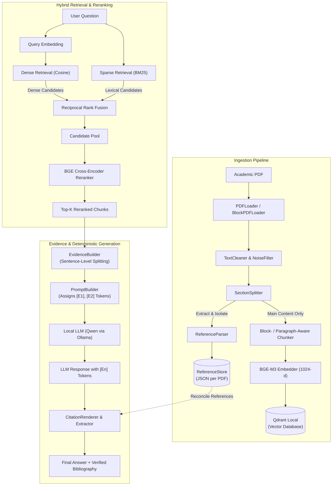

# Local Academic PDF RAG

<p align="center">
  <em>A privacy-first, locally hosted Retrieval-Augmented Generation engine designed specifically for academic literature, featuring deterministic citation attribution and hybrid neural-lexical search.</em>
</p>

<p align="center">
  
  
  
  
  
  
  
  
</p>

<!-- DEMO / VISUAL PLACEHOLDER -->
<p align="center">
  
  <br>
  <em>Interactive CLI demonstration: Deterministic citation resolution mapping <code>[E1]</code> tokens directly to paper references and page numbers.</em>
</p>

---

## Table of Contents

- [Overview](#overview)
  - [The Problem](#the-problem)
  - [The Solution](#the-solution)
- [Key Features](#key-features)
- [System Architecture](#system-architecture)
  - [End-to-End Pipeline Flow](#end-to-end-pipeline-flow)
  - [Deterministic Citation Resolution](#deterministic-citation-resolution)
- [Tech Stack](#tech-stack)
- [Project Structure](#project-structure)
- [Prerequisites & Hardware Requirements](#prerequisites--hardware-requirements)
  - [Hardware Specifications](#hardware-specifications)
  - [Software Prerequisites](#software-prerequisites)
- [Step-by-Step Installation](#step-by-step-installation)
  - [1. Clone & Virtual Environment](#1-clone--virtual-environment)
  - [2. Install Dependencies](#2-install-dependencies)
  - [3. Configure Environment Variables](#3-configure-environment-variables)
- [Quickstart (TL;DR)](#quickstart-tldr)
- [Usage & Execution](#usage--execution)
  - [1. Ingesting Academic Papers](#1-ingesting-academic-papers)
  - [2. Interactive CLI Chat](#2-interactive-cli-chat)
  - [3. Running Quantitative Evaluations](#3-running-quantitative-evaluations)
  - [4. Model Context Protocol (MCP) Server](#4-model-context-protocol-mcp-server)
  - [5. Python API Example](#5-python-api-example)
- [Evaluation & Benchmarks](#evaluation--benchmarks)
- [Roadmap](#roadmap)
- [Contributing](#contributing)
- [License & Acknowledgments](#license--acknowledgments)

---

## Overview

### The Problem

Standard Retrieval-Augmented Generation (RAG) frameworks break down when applied to peer-reviewed scientific literature:

1. **Hallucinated & Broken Citations:** Generative LLMs frequently hallucinate bracketed reference markers (e.g., asserting claims and arbitrarily tagging them with `[1]` or `[14]`).
2. **Bibliography Vector Contamination:** Typical document splitters ingest raw bibliography pages into vector databases. Search queries subsequently retrieve meaningless reference strings as "supporting evidence."
3. **Complex Academic Layouts:** Scientific publications use multi-column formats, running headers/footers, and hyphenated line-breaks that corrupt semantic chunk boundaries.
4. **Data Privacy & Cost:** Proprietary manuscripts, pre-prints, and institutional research cannot be leaked to commercial cloud APIs.

### The Solution

`Local Academic PDF RAG` is a fully local, privacy-first retrieval and generation engine engineered specifically to solve academic document challenges. It isolates bibliographies before vectorization, stores structured reference mappings, breaks chunks down into sentence-level evidence tokens (`[En]`), and forces the LLM to cite only provided evidence tokens. 

A deterministic Python translation layer then reconciles those tokens against document indices, guaranteeing that every citation points to an authentic paper reference (`[paper.pdf, ref 24]`) or an exact page coordinate (`[paper.pdf, page 8]`).

---

## Key Features

- 🛡️ **Guaranteed Citation Attribution:** Eliminates citation hallucination. The LLM only cites surrogate evidence markers (`[E1]`, `[E2]`), which Python deterministically resolves to exact bibliography entries or page numbers.
- 🚫 **Automated Bibliography Segregation:** Parses sequential chains (`[1]`, `1.`, `1)`) using layout-aware heuristics, storing them in dedicated per-paper JSON stores while excluding bibliography pages from embedding.
- ⚡ **Hybrid Dense-Sparse Retrieval:** Integrates dense vector representations (`BAAI/bge-m3`) with BM25 lexical search (`rank-bm25`), unified via **Reciprocal Rank Fusion (RRF)**.
- 🎯 **Cross-Encoder Precision Reranking:** Evaluates question-context candidate pairs with `BAAI/bge-reranker-v2-m3`, fine-tuned for CPU inference to operate within low-VRAM constraints (e.g., 4GB laptop GPUs).
- 🧩 **Advanced Structure- & Block-Aware Ingestion:** Features multiple ingestion engines (`v1` baseline and `v2` block/structure-aware) that remove margin noise, detect headings, and reconstruct section hierarchies.
- 🔒 **100% Offline & Zero Cloud Dependencies:** Runs on embedded Qdrant (in-process storage without Docker) and Ollama for local LLM inference.
- 📊 **Scientific Evaluation Rig:** Includes built-in evaluation suites for Hit@K, Page Precision@K, Page Recall@K, and MRR across multi-document gold sets.
- 🔌 **Extensible Ecosystem:** Ships with an integrated Model Context Protocol (MCP) server, external knowledge services, and tabular Excel ingestion capabilities.

---

## System Architecture

### End-to-End Pipeline Flow



### Deterministic Citation Resolution

Instead of prompting the LLM to write citations directly, the pipeline enforces strict attribution constraints:

1. **Extraction:** Evidence sentences are tagged with IDs:
   ```text
   [E1] Metamaterials demonstrate negative refractive index properties...
   [E2] Conventional designs require manual unit-cell tuning...
   ```
2. **Generation:** The model answers exclusively citing assigned tokens:
   ```text
   Metamaterials exhibit negative refraction [E1], replacing manual tuning [E2].
   ```
3. **Reconciliation:** Python deterministically replaces markers with audited citations:
   ```text
   Metamaterials exhibit negative refraction [GJETA-2025.pdf, ref 24], replacing manual tuning [GJETA-2025.pdf, page 8].
   ```
4. **Bibliography Emission:** Exact reference metadata is appended directly from the `ReferenceStore`.

---

## Tech Stack

| Category | Component / Tool | Details |
|---|---|---|
| **Core Runtime** | Python `>=3.11` | Primary implementation language |
| **PDF Extraction** | [PyMuPDF (fitz)](https://github.com/pymupdf/PyMuPDF) | High-performance text and block coordinate parsing |
| **Embeddings** | [BAAI/bge-m3](https://huggingface.co/BAAI/bge-m3) | Multilingual 1024-dimensional dense representations |
| **Vector Database** | [Qdrant Client (Embedded)](https://github.com/qdrant/qdrant-client) | Zero-dependency local persistent vector storage |
| **Sparse Retrieval** | [rank-bm25](https://github.com/dorianbrown/rank_bm25) | In-memory BM25Okapi inverted index over chunks |
| **Reranking** | [BAAI/bge-reranker-v2-m3](https://huggingface.co/BAAI/bge-reranker-v2-m3) | Cross-encoder relevance scoring (CPU-optimized) |
| **LLM Inference** | [Ollama](https://ollama.com/) | Local model runner hosting Qwen models (`qwen3.5:4b`, `qwen2.5:7b`) |
| **Alternative LLM** | Google GenAI SDK | Cloud fallback client for comparative evaluation |
| **Protocols & Standards** | Model Context Protocol (MCP) | Exposes search, ingestion, and context via stdio MCP |
| **Data Validation** | Pydantic v2 | Rigorous typed schema validation for records and metrics |

---

## Project Structure

```text
local_rag/
├── data/
│   ├── pdfs/                     # Raw academic PDF drop directory
│   ├── references/               # Extracted per-document JSON bibliographies
│   ├── vector_store/             # Local Qdrant vector database storage
│   └── evaluation/               # Benchmark gold datasets (JSON)
│
├── docs/                         # Detailed architecture & module documentation
│   ├── index.md                  # Documentation hub
│   ├── ingestion.md              # Ingestion, section tree, & noise filtering
│   ├── retrieval.md              # Hybrid retrieval, RRF, & reranking
│   ├── references.md             # Citation normalization & rendering
│   ├── generation_and_llm.md     # Prompt builder & Ollama/Gemini clients
│   ├── storage_and_embeddings.md # Qdrant & BGE-M3 integration
│   └── extensions.md             # MCP server, Knowledge, & Excel services
│
├── src/
│   └── local_rag/
│       ├── config.py             # Centralized settings and environment management
│       ├── embeddings/           # BGE-M3 embedding wrapper
│       ├── evaluation/           # Retrieval metrics, evaluator, & data models
│       ├── excel/                # Structured Excel ingestion service
│       ├── generation/           # Evidence-to-prompt assembly logic
│       ├── ingestion/            # PDF loaders, cleanings, chunkers, & pipelines
│       ├── knowledge/            # Unified document ingestion/knowledge coordinator
│       ├── llm/                  # Base, Ollama, and Gemini LLM clients
│       ├── mcp/                  # FastMCP / JSON-RPC server implementation
│       ├── references/           # Bibliography stores & citation renderers
│       ├── retrieval/            # Dense, sparse, hybrid retrievers & fusion
│       └── vector_store/         # Embedded Qdrant client wrappers
│
├── scripts/
│   ├── ingest.py                 # CLI orchestration for ingesting PDFs
│   ├── chat.py                   # Interactive terminal Q&A interface
│   ├── mcp_server.py             # Entrypoint for running the MCP server
│   ├── evaluate_retrieval.py     # Dense vs. Reranker benchmark runner
│   ├── evaluate_hybrid_retrieval.py # Hybrid (Dense + BM25 + RRF) evaluator
│   ├── evaluate_k_sweep.py       # Top-K parameter sensitivity sweep
│   └── evaluate_candidate_sweep.py # Candidate pool size sweep
│
├── tests/                        # Automated unit and integration test suite
├── .env.example                  # Environment configuration template
├── pyproject.toml                # Project packaging metadata
├── requirements.txt              # Pinned pip dependencies
└── README.md                     # Project documentation
```

---

## Prerequisites & Hardware Requirements

### Hardware Specifications

| Spec | Minimum Requirement | Recommended Specification |
|---|---|---|
| **System RAM** | **16 GB** | **32 GB** (for larger corpus ingestion & in-memory BM25 indexing) |
| **Processor (CPU)** | Modern 4-core / 8-thread CPU | Modern 6+ core CPU (e.g., Intel Core i5-12500H / AMD Ryzen 5 or higher) |
| **GPU / VRAM** | **Optional** (0 GB) | **4 GB - 8+ GB NVIDIA GPU** |
| **Disk Space** | ~10 GB free space | SSD with >=20 GB free space (model weights & vector indexes) |

> 💡 **Low-VRAM & GPU Note:** The cross-encoder reranker runs on CPU by default (`RERANKER_DEVICE=cpu`) to preserve GPU VRAM for the local LLM. If your machine features an entry-level GPU (e.g., NVIDIA RTX 3050 Laptop with 4 GB VRAM), the system executes comfortably without Out-Of-Memory (OOM) errors. If you have a discrete GPU with **>=8 GB VRAM**, you can switch `RERANKER_DEVICE=cuda` for full CUDA acceleration.

### Software Prerequisites

- **OS:** Linux, macOS, or Windows (WSL2 recommended)
- **Python:** `3.11` or `3.12`
- **Ollama:** Installed and running locally ([Download Ollama](https://ollama.com/download))

Pull your preferred local model tag (make sure it matches `OLLAMA_MODEL` in your `.env`):
```bash
# Recommended default model:
ollama pull qwen3.5:4b

# Alternative supported tags (e.g., Qwen 2.5 or Llama 3 series):
# ollama pull qwen2.5:7b
# ollama pull qwen2.5:3b
# ollama pull llama3.2:3b
```

---

## Step-by-Step Installation

### 1. Clone & Virtual Environment

```bash
# Clone repository
git clone https://github.com/mrprogrammerdeveloper/local_rag.git
cd local_rag

# Linux / macOS / WSL2:
python3 -m venv .venv
source .venv/bin/activate

# Windows (PowerShell):
python -m venv .venv
.\.venv\Scripts\Activate.ps1
```

### 2. Install Dependencies

```bash
pip install --upgrade pip
pip install -e .
pip install -r requirements.txt
```

### 3. Configure Environment Variables

Copy the provided environment template:
```bash
cp .env.example .env
```

Review or modify `.env` to match your local setup:
```dotenv
# Ollama LLM Configuration (Set to any pulled Ollama model tag)
OLLAMA_HOST=http://localhost:11434
OLLAMA_MODEL=qwen3.5:4b

# Data Storage Paths
PDF_PATH=data/pdfs
VECTOR_PATH=data/vector_store
REFERENCES_PATH=data/references

# Embedding Model (BAAI/bge-m3 default, 1024-dim)
EMBEDDING_MODEL=BAAI/bge-m3

# Paragraph Chunking Configuration
CHUNK_SIZE=500
CHUNK_OVERLAP=75

# Retrieval Configuration
TOP_K=5
RETRIEVAL_CANDIDATES=8

# Reranker Settings (CPU recommended for low-VRAM GPUs)
RERANKER_MODEL=BAAI/bge-reranker-v2-m3
RERANKER_DEVICE=cpu
RERANKER_BATCH_SIZE=4
```

---

## Quickstart (TL;DR)

Get from zero to chatting with your academic papers in 3 simple commands:

```bash
# 1. Clone, set up virtual environment, and install dependencies
git clone https://github.com/mrprogrammerdeveloper/local_rag.git && cd local_rag
python3 -m venv .venv && source .venv/bin/activate && pip install -e . -r requirements.txt
cp .env.example .env && ollama pull qwen3.5:4b

# 2. Drop your academic PDFs into data/pdfs/ and run ingestion
# (Example: cp /path/to/papers/*.pdf data/pdfs/)
python scripts/ingest.py

# 3. Launch interactive terminal Q&A
python scripts/chat.py
```

---

## Usage & Execution

### 1. Ingesting Academic Papers

Place target academic papers (`.pdf`) into the configured folder (`data/pdfs/`), then execute:

```bash
python scripts/ingest.py
```

*Ingestion workflow:*
- Extracts text page-by-page while preserving column alignment.
- Isolates and normalizes bibliography sections, writing them to `data/references/<filename>.json`.
- Chunks narrative text with structural heading context.
- Generates 1024-d dense embeddings via `BAAI/bge-m3` and persists them into Qdrant Local.

### 2. Interactive CLI Chat

Launch the interactive chat interface:

```bash
python scripts/chat.py
```

**Terminal Session Preview:**

```text
==================================================
  Local Academic RAG - Interactive Chat
==================================================
Enter your question (or 'quit' to exit):
> What are the advantages of mechanical metamaterials?

Answer:
Mechanical metamaterials offer tailored stiffness-to-weight ratios and customizable energy absorption [GJETA-2025.pdf, ref 24]. Unlike conventional alloys, their properties are governed by cellular micro-architecture rather than chemical composition alone [GJETA-2025.pdf, page 4].

References:
[1] Schurig, D., et al., "Electric-field-coupled resonator for metamaterials," Applied Physics Letters, 2006.
[2] GJETA-2025.pdf, Page 4 (Direct section context)
```

### 3. Running Quantitative Evaluations

Evaluate retrieval precision, recall, and ranking effectiveness across candidate configurations:

```bash
# Compare Dense vs. Dense + Reranker:
python scripts/evaluate_retrieval.py

# Evaluate Dense + BM25 + Reciprocal Rank Fusion + Reranking:
python scripts/evaluate_hybrid_retrieval.py

# Run Top-K parameter sensitivity sweep:
python scripts/evaluate_k_sweep.py

# Run candidate pool size sweep:
python scripts/evaluate_candidate_sweep.py
```

### 4. Model Context Protocol (MCP) Server

Expose `local-rag` retrieval, document extraction, and Excel query capabilities over standard input/output (stdio) for MCP-compliant clients (e.g., Claude Desktop, Cursor, Antigravity):

```bash
python scripts/mcp_server.py
```

### 5. Python API Example

Embed `local-rag` modular components into your own Python applications:

```python
from local_rag.config import settings
from local_rag.retrieval.retriever import Retriever
from local_rag.retrieval.reranker import Reranker
from local_rag.retrieval.evidence_builder import EvidenceBuilder
from local_rag.generation.prompt_builder import PromptBuilder
from local_rag.llm.ollama_client import OllamaClient
from local_rag.references.citation_renderer import CitationRenderer

# 1. Retrieve candidates & rerank
retriever = Retriever()
candidates = retriever.retrieve("What is inverse design in metamaterials?", k=8)

reranker = Reranker()
top_chunks = reranker.rerank("What is inverse design in metamaterials?", candidates, top_k=5)

# 2. Break down into sentence-level evidence tokens
evidence_builder = EvidenceBuilder()
evidence_items = evidence_builder.build_evidence(top_chunks)

# 3. Assemble prompt with strict [En] instructions & query local LLM
prompt_builder = PromptBuilder()
prompt = prompt_builder.build(query="What is inverse design in metamaterials?", evidence=evidence_items)

llm = OllamaClient()
response = llm.generate(prompt)

# 4. Deterministically resolve [En] tokens to verified paper references
renderer = CitationRenderer()
final_answer = renderer.render(response.text, evidence_items)
print(final_answer)
```

---

## Evaluation & Benchmarks

Retrieval experiments conducted against clean, multi-document academic benchmarks yield the following performance metrics:

| System Pipeline | Hit@K | Page Precision@K | Page Recall@K | MRR |
|---|:---:|:---:|:---:|:---:|
| **Dense Only** (`BGE-M3`) | 1.0000 | 0.5900 | 0.7000 | 0.8000 |
| **Dense + Cross-Encoder** (`BGE Reranker v2`) | 1.0000 | **0.7000** | 0.7667 | **1.0000** |
| **Hybrid + Reranker** (`Dense + BM25 + RRF + Reranker`) | 1.0000 | 0.6900 | **0.8333** | 0.9000 |

*Key Insights:*
- **Cross-Encoder Reranking:** Maximizes Mean Reciprocal Rank (MRR 1.0000), placing critical evidence in the first chunk.
- **Hybrid Fusion (RRF):** Delivers the highest overall context recall (0.8333), reliably capturing domain-specific terminology missed by dense embeddings alone.

---

## Roadmap

- [x] High-accuracy PDF layout parsing & cleaner
- [x] Multi-format bibliography parser (`[N]`, `N.`, and `N)`)
- [x] Separate reference storage and bibliography vector exclusion
- [x] Sentence-level evidence mapping & deterministic citation rendering
- [x] BGE-M3 dense embeddings + embedded Qdrant vector database
- [x] In-memory BM25 sparse retrieval & Reciprocal Rank Fusion (RRF)
- [x] BGE-Reranker v2 cross-encoder integration (CPU-optimized)
- [x] Model Context Protocol (MCP) server
- [ ] Expansion of gold evaluation dataset (targeting 30–50 annotated queries)
- [ ] Automated faithfulness, citation recall, and hallucination metrics (RAGAS-style)
- [ ] OCR integration (Tesseract / PaddleOCR) for scanned legacy literature
- [ ] Automated paper metadata extraction (DOI, Authors, Journal, Year)

---

## Contributing

Contributions from the open-source community are warmly welcomed. To contribute:

1. **Fork the Repository:** Create your own feature branch (`git checkout -b feature/amazing-feature`).
2. **Commit Your Changes:** Keep commits atomic and descriptive (`git commit -m "feat: add section hierarchy parsing"`).
3. **Execute Test Suite:** Ensure tests pass using `pytest`:
   ```bash
   pytest tests/
   ```
4. **Push to Your Branch:** (`git push origin feature/amazing-feature`).
5. **Open a Pull Request:** Detail the changes, motivation, and any evaluation impacts.

---

## License & Acknowledgments

### License
Distributed under the **MIT License**. See `LICENSE` for more information.

### Acknowledgments
- [BAAI](https://github.com/FlagOpen/FlagEmbedding) for developing the `BGE-M3` and `BGE-Reranker-v2-m3` models.
- [Qdrant](https://qdrant.tech/) for their fast, zero-dependency embedded vector database.
- [Ollama](https://ollama.com/) for making local LLM deployment effortless.
- [PyMuPDF](https://github.com/pymupdf/PyMuPDF) for high-performance PDF layout parsing.
